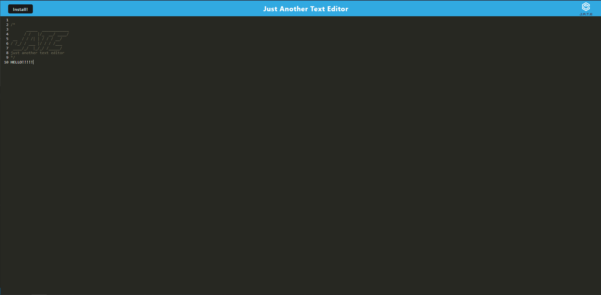

# Challange 19 Just Another Text Editor

The challenge required students to complete code to create a single paged application that acts like a text editor called Just another text editor.

Contents: client and server folders

Link:

Please find attached a snippet screenshot of Challenge 19 below:

My GitHub: [RyanZade](https://github.com/RyanZade)
